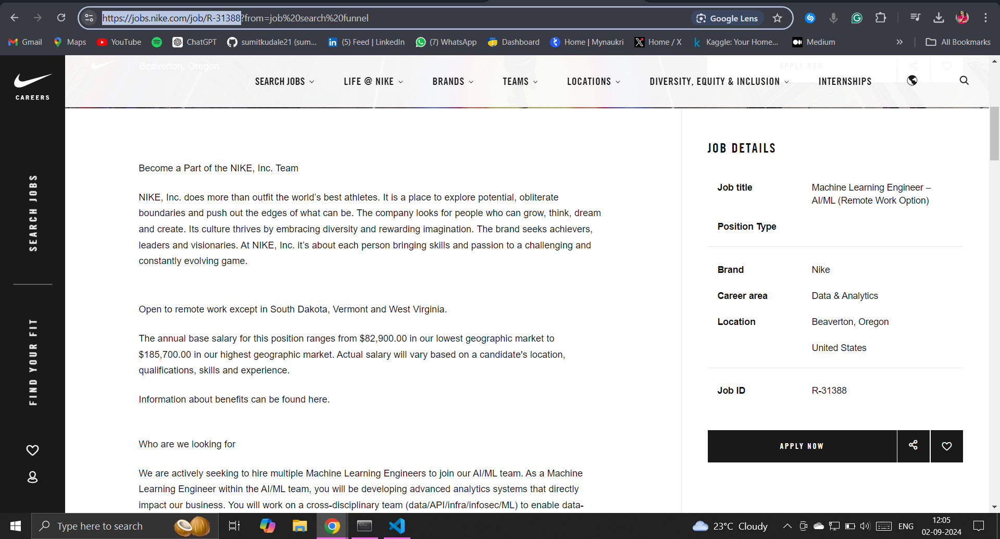
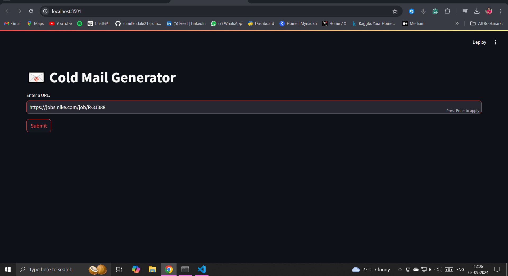
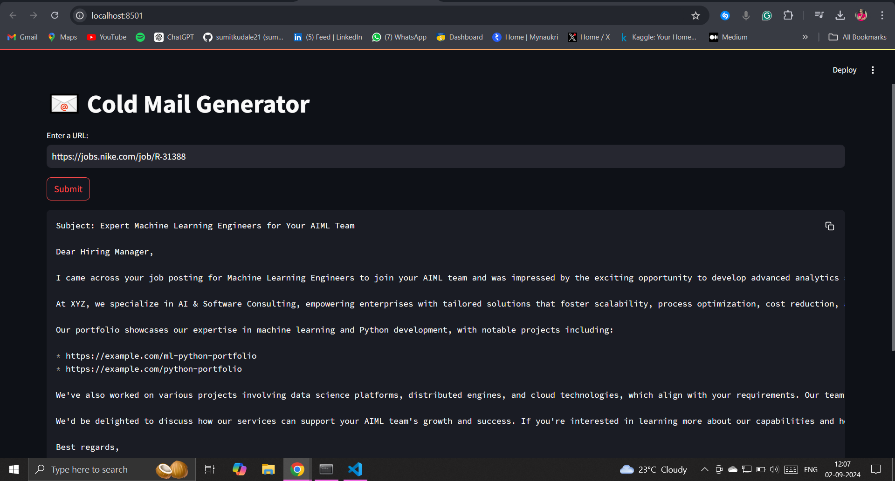

# Cold Email Generator

## Overview
The **Cold Email Generator** is a web application designed to help individuals or companies craft personalized cold emails efficiently. This tool is particularly useful for service companies looking to approach product companies, like Nike, to offer their services, such as software development or machine learning engineering. Instead of manually drafting emails, users can input the job description link, and the website generates a tailored cold email, simplifying the outreach process.

## How It Works
1. **User Input:** The user provides a job description link from a product company.
   - 

2. **Paste the Link:** The user pastes the link into the provided input field on the website.
   - 

3. **Cold Email Generation:** The application processes the job description and generates a personalized cold email using advanced Generative AI tools.
   - increasing the chances of a successful connection.

## Features
- **Automated Cold Email Generation:** Saves time and effort by generating emails tailored to specific job descriptions.
- **User-Friendly Interface:** Built with Streamlit, the web interface is intuitive and easy to use.
- **Customizable Outputs:** Users can further refine the generated email if needed.
- **Generative AI-Powered:** Leveraging tools like Groq, LLaMA 3, and LangChain for high-quality email generation.
- **Efficient Storage:** ChromaDB is used to efficiently manage and retrieve job descriptions and generated emails.

## Tools & Technologies
- **Groq**: For AI model acceleration.
- **LLaMA 3**: As the core language model for understanding job descriptions and generating emails.
- **LangChain**: To manage prompts and chains in the email generation process.
- **Streamlit**: Used for building the web interface.
- **ChromaDB**: For storing and managing job descriptions and email data.

## Use Case
Consider a scenario where a product company like Nike wants to hire an IT expert such as a software developer or machine learning engineer. A professional from a service company wants to offer their services to Nike. Using this Cold Email Generator, the professional can generate a well-structured email that is tailored to the specific job description, making their outreach more effective.

## Getting Started
To get started with the Cold Email Generator, follow these steps:

1. **Clone the repository:**
   ```bash
   git clone https://github.com/yourusername/cold-email-generator.git
2. **Install the required dependencies:**
   ```bash
   pip install -r requirements.txt
3. **Run the Streamlit application:**
   ```bash
   streamlit run app.py
